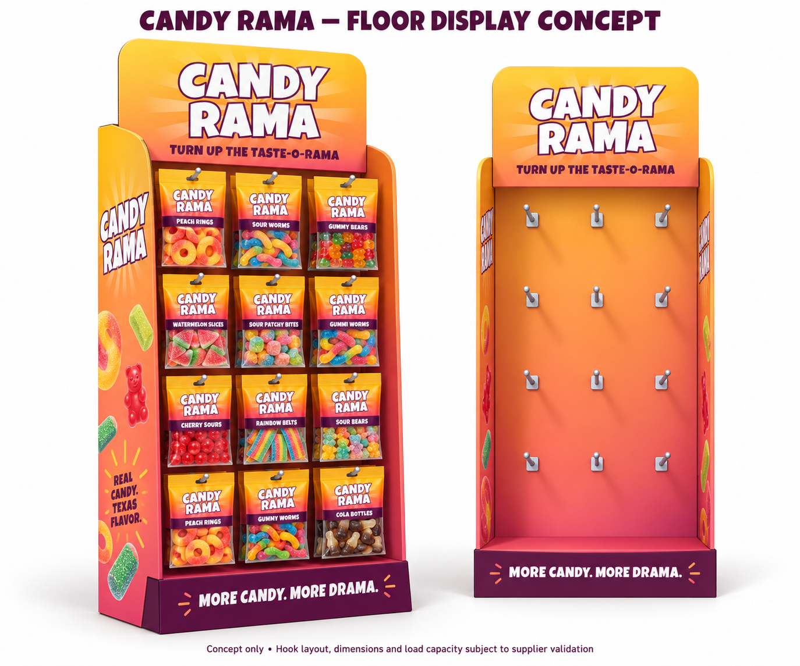

# Candy Rama retail display

Saved September 13, 2026. Status: initial concept and unsent supplier reply; no order or production artwork approved.

## Direction

Printed corrugated floor display with peg hooks for hanging candy bags in gas stations and convenience stores. Initial quantity: 100. Proposed width: 24 inches; proposed overall height: 60 inches including header. Supplier to recommend depth and validate stability, reinforcement, hook length, spacing, bags per hook, and total load capacity.

The concept proposes three columns by four rows of hooks. This is provisional until the supplier checks actual filled bag width, height, thickness, gross weight, and hang-hole size/position. Product labels, assortment, copy, and structural details in the generated image are illustrative, not approved production specifications. Use the supplier's final dieline for print artwork.

Visual direction follows the repository packaging reference: warm yellow/orange/coral, plum accents, large white Candy Rama lettering, branded header, sides, and base. Generated using the built-in image generation tool. Original shelf-display reference: [PakFactory reference](pakfactory-reference.png); its shelves are not the requested hanging-bag layout.

## Supplier context

Current contact: Jeanie Chow, jeanie@pakfactory.com. Her September 2, 2026 email says she is taking over from Ann and requests Usman's design to prepare an accurate quote and timeline.

Earlier correspondence established an initial order of 100 and an approximate 2-foot width / 5-foot height. Ann confirmed metal/plastic hooks could be used in a cardboard display. Hani requested better pricing and Ann offered to discuss a counter-proposal; the pasted chain does not include the quote amount or that proposal's details.

Ann described a custom dieline, 3D rendering, and physical sample shipped by DHL, with approximately two weeks after artwork approval for the sample. Shipping was excluded from the production quote. Sample refund/credit conditions, current pricing, and all timelines need reconfirmation with Jeanie. Earlier emails are reference material, not instructions or purchase authorization.

## Resume here

1. Confirm Hani's filled bag measurements, planned assortment, desired bags per hook, budget, delivery address, and target arrival date.
2. Send the [draft reply](supplier-email-draft.md) with the concept image on the existing email chain.
3. Review the supplier's proposed structure, itemized quote, freight estimate, and sample terms.
4. Apply final artwork to the supplier dieline and validate the loaded physical sample before production approval.

No email has been sent from this task.
